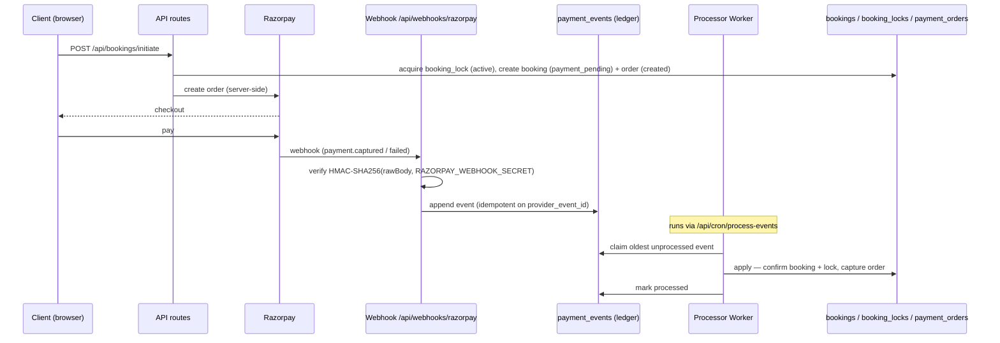

# Payment Architecture

How money moves through CreatorOS. This system is **complete and frozen** —
treat it as infrastructure. Do not redesign it, swap providers, or let any code
outside the Processor mutate payment state.

## Core principles

1. **The Processor is the only writer of truth.** Only the Processor Worker may
   change `bookings.status`, `booking_locks.status`, or `payment_orders.status`.
   Webhooks, cron jobs, API routes, and server actions **emit events**; the
   Processor applies them. Nothing else is allowed to confirm or cancel a booking.
2. **`correlation_id` is the forensic key.** Every payment-system row carries a
   non-null `correlation_id`. A booking's entire lifecycle is reconstructable
   from it.
3. **The event ledger is append-only and immutable.** `payment_events` rows can
   never be deleted, and only `(processed, processed_at)` may change — enforced
   by DB triggers. Duplicate provider deliveries collapse on the
   `(event_source, provider_event_id)` unique constraint, so re-delivery is a
   no-op.
4. **Provider isolation.** The Razorpay SDK may be imported **only** under
   `src/lib/payments/providers/*`. This boundary is a CI gate
   (`tests/provider-boundary.test.ts`) and is what makes the future Razorpay
   Route migration possible without touching business logic.

## Money flow today

- There is **one platform Razorpay account**. Clients pay into it.
- **Razorpay Route is not live yet.** Creators cannot receive payouts; funds
  settle to the platform account. `creator_payment_profiles.payouts_enabled` is
  the single source of truth for "can this creator actually receive money" and
  is `false` until Route ships. The five-state machine
  (`not_started → pending_route → pending_verification → active → rejected`)
  exists so the UI needs no rewrite when Route goes live.

## Lifecycle

## Components

| Component | Location | Role |
|---|---|---|
| Checkout + order creation | `src/app/api/bookings/initiate` | Server-side order, acquires the slot lock, creates booking + `payment_orders` row |
| Webhook ingestor | `src/app/api/webhooks/razorpay/route.ts` | Verifies signature, appends to the ledger. Never mutates booking state |
| Signature verification | `src/lib/payments/providers/*` | `HMAC_SHA256(rawBody, RAZORPAY_WEBHOOK_SECRET)`, constant-time compare. Missing secret ⇒ reject |
| Event ledger | `payment_events` table | Append-only, immutable, deduplicated |
| Processor Worker | `src/app/api/cron/process-events` | The **only** mutator of truth; claims events oldest-first |
| Reconciliation | `src/lib/payments/reconcile.ts` (`reconcileTick`) | Ages expired holds (`active → pending_reconciliation`) via `expireToReconciliation`, then sweeps targets against the provider |
| Notifications | `src/lib/notifications/worker.ts` + `/api/cron/notifications` | Drains `notification_queue` with retry/dead-letter |
| Recovery audit | `recovery_actions` table | Append-only log of the 3 safe operator actions |

## Slot concurrency (no double-booking)

Availability is computed from `booking_locks` **only**, never from `bookings`.
A partial unique index `booking_lock_active_slot_idx` on
`(creator_id, slot_start) where status in ('active','pending_reconciliation','confirmed')`
is the hard DB-level guarantee: a losing race insert fails with SQLSTATE `23505`.
**Timer expiry never releases a slot** — it moves the lock to
`pending_reconciliation` for the sweep to resolve. Only a verified provider
failure releases a lock.

## Cron endpoints (all gated by `CRON_SECRET`)

| Endpoint | Drives |
|---|---|
| `/api/cron/process-events` | Processor — applies ledger events to truth |
| `/api/cron/reconcile` | `reconcileTick` — expiry aging + provider sweep |
| `/api/cron/notifications` | Notification worker |
| `/api/cron/integrity` | Monitoring / invariant checks |

`/api/cron/*` is also auth-gated by the proxy (`src/proxy.ts`).

> ⚠️ **Scheduler gap.** `vercel.json` has `crons: []` (Hobby plan), so **none of
> these run automatically.** Today they only fire on manual `curl`. Until an
> external scheduler (e.g. Upstash QStash) hits these endpoints on a cadence,
> payments confirm only when triggered by hand and expired holds never age
> (slot leak). See `launch-checklist.md`.

## Secrets

- `RAZORPAY_WEBHOOK_SECRET` — the HMAC key. Must match the secret configured on
  the Razorpay dashboard webhook **character-for-character** in every
  environment (dashboard ↔ Vercel ↔ local), or every signature check fails.
- `CRON_SECRET` — shared bearer secret for all `/api/cron/*` endpoints.
- `RAZORPAY_KEY_ID` / `RAZORPAY_KEY_SECRET` — API credentials (currently test
  keys; see launch checklist).
